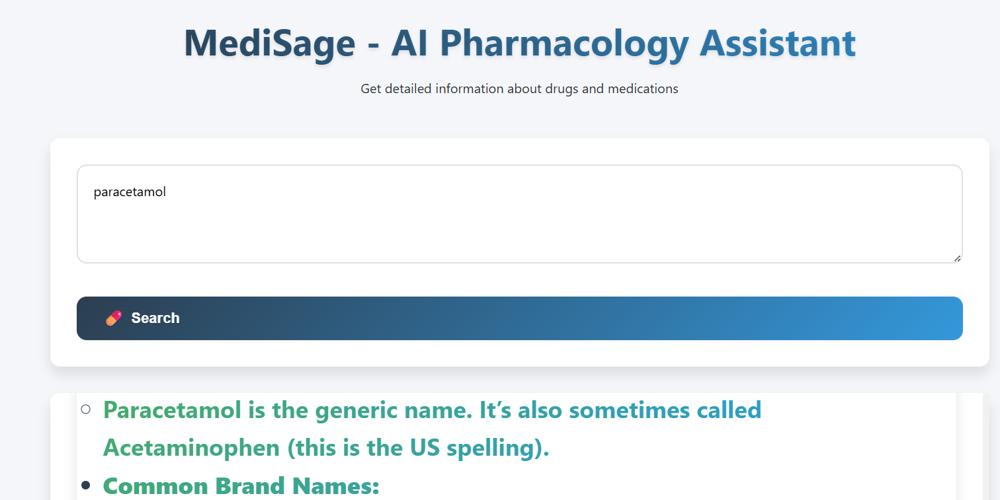

# MediSage - AI Pharmacology Assistant


> **Developed by ALAN CYRIL SUNNY**  
> If you find this project helpful, please ⭐ [star the repository](https://github.com/dragonpilee/medisage)!

---

## 💊 MediSage - AI Pharmacology Assistant

A professional, AI-powered pharmacology assistant that delivers detailed drug information and medication guidance in real time.

- 🧠 AI-powered drug information system  
- 📚 Comprehensive drug details and summaries  
- 💊 Professional, user-friendly interface  
- 🚀 Fast, efficient, and streaming responses  
- 📱 Fully responsive design for all devices  
- 📋 Caching for faster repeat queries  
- 🟩 **Optimized for NVIDIA RTX GPUs** for accelerated AI inference  
- 🟪 **Custom-tuned Gemma-4B model** for enhanced pharmacology expertise

MediSage is powered by a custom-tuned Gemma-4B language model via LM Studio.

---

## 📸 Application Preview



---

## ✨ Features

- **AI Drug Info**: Get instant, reliable drug information and summaries.
- **Professional UI**: Clean, organized, and user-friendly interface.
- **Real-time Streaming**: See answers as they’re generated.
- **Caching**: Fast repeat queries with smart caching.
- **Mobile Ready**: Fully responsive for desktop and mobile.
- **Markdown Support**: Rich, readable formatting for responses.
- **NVIDIA RTX Optimized**: Leverages CUDA acceleration for faster model inference on RTX GPUs.
- **Custom-tuned Model**: Utilizes a domain-specialized Gemma-4B model for superior pharmacology answers.

---

## 🛠️ Tech Stack

- [Flask](https://flask.palletsprojects.com/) – backend framework
- [Python 3.8+](https://www.python.org/downloads/) – language
- [Custom Gemma-4B](https://lmstudio.ai/) – custom-tuned language model (via LM Studio)
- [LM Studio](https://lmstudio.ai/) – model serving platform (with NVIDIA RTX GPU support)
- [HTML5, CSS3, JavaScript] – frontend
- **Markdown** – for response formatting

---

## 💻 Local Development

### Installation

1. Clone the repository:
   ```bash
   git clone https://github.com/dragonpilee/medisage.git
   cd medisage
   ```

2. Install dependencies:
   ```bash
   pip install -r requirements.txt
   ```

3. Ensure you have an NVIDIA RTX GPU and the latest [CUDA Toolkit](https://developer.nvidia.com/cuda-downloads) installed for optimal performance.

4. Make sure your LM Studio instance is running the **custom-tuned Gemma-4B model**.

5. Run the application:
   ```bash
   python app.py
   ```

6. Open your browser and navigate to [http://localhost:5000](http://localhost:5000)

---

## 🖥️ System Requirements

- Python 3.8+
- Flask
- Markdown
- LM Studio with **custom-tuned Gemma-4B model**
- **NVIDIA RTX GPU** (recommended for best AI inference speed)
- CUDA Toolkit (for GPU acceleration)

---

## 📁 Project Structure

```
medisage/
├── app.py              # Main Flask application
├── requirements.txt    # Python dependencies
├── lmstudio_client.py  # LM Studio API client
├── medisage.png        # Application screenshot
├── templates/
│   └── index.html      # Main HTML template
└── static/             # Static assets (CSS, JS, images)
```

---

## 📝 Usage

1. **Enter a drug name or interaction query** in the search box.
2. **Submit your query** and view detailed drug information instantly.
3. **Enjoy a clean, organized, and professional interface** for all your pharmacology needs.

---

## 🤝 Contributing

Contributions are welcome!  
1. Fork the repository  
2. Create a new branch  
   ```bash
   git checkout -b feature/amazing-feature
   ```
3. Make your changes and commit  
   ```bash
   git commit -m 'Add some amazing feature'
   ```
4. Push to your branch  
   ```bash
   git push origin feature/amazing-feature
   ```
5. Open a Pull Request

Please read our [Contributing Guidelines](CONTRIBUTING.md) before submitting a pull request.

---

## 📄 License

This project is licensed under the [MIT License](LICENSE).

---

## 🙏 Acknowledgements

- Powered by custom-tuned Gemma-4B language model via LM Studio
- Built with Flask
- **Optimized for NVIDIA RTX GPUs**
- Created by ALAN CYRIL SUNNY

---

For more info, updates, and documentation, visit the  
👉 [GitHub Repository](https://github.com/dragonpilee/medisage)

Feel free to fork, star ⭐, and contribute!
